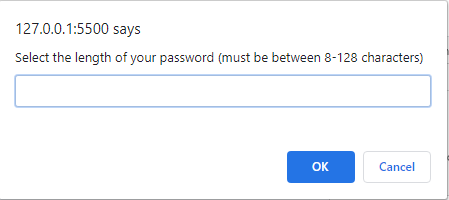

# Secure-Password

The secure password generator allows the user to select the # of characters they'd like to include in their password, along with the criteria for characters they'd like to include (ie. upper/lower case, numbers, or special characters). Once the user has successfully selected at least 1 criteria, their password will be visible in the box provided. 

# Features

This page includes a "click" function that triggers the prompts for selecting password length and criteria. It also includes, if/else statements, variables and functions that determine the users password at random. 

# Images

Password Generator

Password Prompt Example

# Links

- Project Homepage: https://arianaw15.github.io/Secure-Password/
- Repository: https://github.com/arianaw15/Secure-Password

# License 

This code is not currently licensed. 

